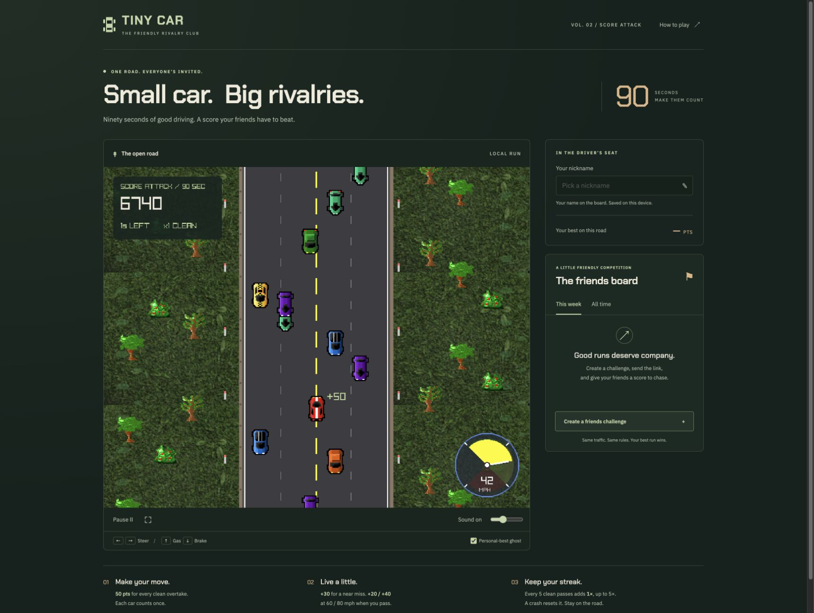
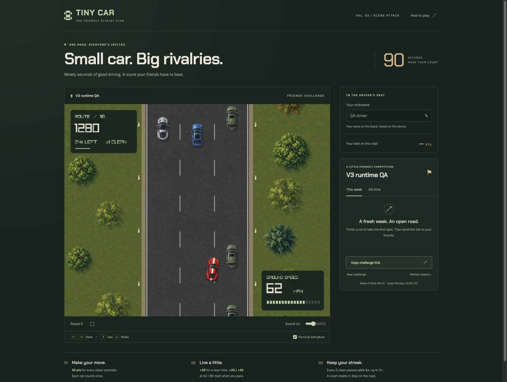
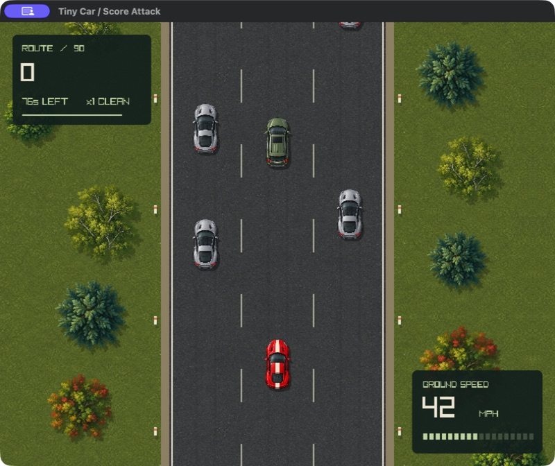
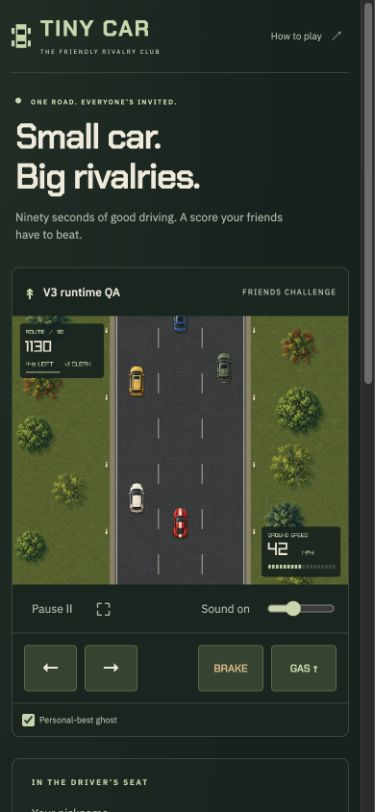

# Tiny Car driving update

The v3 update keeps the three-second countdown and 90-second score attack. Native and WebAssembly builds use the same simulation.

## Changes

Steering now depends on speed and retains a small amount of sideways momentum. Releasing steering settles the car. Acceleration, cruise, and braking change gradually. A stopped car cannot move sideways. Body rotation stays within eight degrees, and collision shapes follow that rotation.

A shared road definition supplies three lane centers, painted boundaries, vehicle dimensions, and shoulder limits. Traffic keeps following gaps and reserves both lanes during a signal and merge. Signals last one second. Merges take two seconds and yield to nearby players. Blocked entrances and full pools consume the same random values as successful spawns. Every complete run makes 113 spawn attempts.

The renderer uses new overhead vehicles, four tree crowns, grass, and asphalt. The vehicle atlas also supplies the player sprite. Every ground object uses the same traveled distance. Adjacent material tiles alternate reflection to share their edge pixels. Vehicle shadows, brake lights, amber signals, short tire marks, dust, and crash sparks supply feedback.

A small synthesized engine loop changes pitch and volume with speed. The native game also accepts quick key taps through Raylib's event queue. This fixes taps that start and end within one display frame.

Simulation, browser, and API versions all use v3. Ghosts record position and body angle. Playback blends valid samples. Old bests, ghosts, challenges, and queued submissions remain separate from current rules. API bounds match the spawn ceiling and reported streak.

## Before and after

These are direct runtime screenshots. They are not generated mockups. The browser captures show different moments in their runs.

| Before | After |
| --- | --- |
|  |  |

The final native renderer:



The phone layout uses a 390-pixel viewport. Steering buttons measure 55 by 48 pixels. Pedal buttons measure 68 by 48 pixels. There is no horizontal overflow.



Additional captures show [shoulder dust](qa/shoulder-dust.jpg), [braking](qa/brake-lights.jpg), [native completion](qa/native-complete.jpg), and [a ranked browser finish](qa/web-complete.jpg).

## Automated results

All commands below passed on September 5, 2026:

```sh
bun install --frozen-lockfile
zig build
zig build test
zig build -Dtarget=wasm32-emscripten
zig build -Doptimize=ReleaseSafe
zig build test -Doptimize=ReleaseSafe
zig build -Dtarget=wasm32-emscripten -Doptimize=ReleaseSafe
bun run test
bun run lint
bun run format:check
zig fmt --check src/*.zig build.zig emcc.zig
git diff --check
```

The Zig suite has 21 tests. It includes 32 complete seeded runs with bounded handling and no traffic-to-traffic overlap. Other tests cover stopped steering, inertia, pedal priority, following gaps, signals, merge reservations, blocked spawns, full pools, rotated collisions, and pause timing. Display rates of 30, 60, and 144 Hz produce identical seeded runs.

The Node suite has 19 tests. It covers browser input, two simultaneous touch pointers, cancellation, dialogs, old-version isolation, malformed ghost samples, heading playback, API accounting, persistence, and rankings. A contract test keeps the three version declarations aligned.

[Native build and test evidence](qa/build-native.txt) and [WebAssembly build evidence](qa/build-web.txt) record successful ReleaseSafe checks. Emscripten reports 11 warnings from Raylib's bundled miniaudio and stb_vorbis code. Both the original and updated builds report these upstream warnings. The web asset bundle is about 10 MB.

## Runtime results

The final ReleaseSafe native game completed a run with 550 points, 11 passes, and six crashes. That run included quick steering taps and an explicit pause/resume. The pause display stayed at 64 seconds during an extended pause. Window focus loss also paused the game. The native renderer displayed all replacement textures.

The final browser game completed and submitted a 14,000-point run to the local QA challenge. It recorded 49 passes, 14 near misses, nine crashes, and 900 ghost samples. The API accepted the result and displayed it on the board. A later 12,090-point finish preserved the stronger best. [The accepted receipt](qa/web-receipt.json) contains the score breakdown without a run token.

A live browser stop test held brake, then held steering for 60 ticks. Speed, sideways velocity, and body angle stayed at zero. The x coordinate stayed at 381. [The recorded measurements](qa/web-stop-check.json) also show active audio output during play. Opening instructions paused the clock and produced zero audio output. Closing instructions kept the game paused until Resume was selected.

Visual inspection covered traffic signals and merges, vehicle alignment, rotated bodies, tree silhouettes, terrain joins, shoulder dust, braking, ghosts, and the phone layout. Browser diagnostics reported no errors or warnings during the final run. Fullscreen opened and closed successfully. Temporary viewport overrides were reset.

## Remaining acceptance check and limitations

A human listening and handling check remains pending. UI automation and audio-buffer measurements do not judge speaker quality or the feel of sustained physical key presses. The request for that feedback remains open. The native QA app and local browser preview are available for that check.

The engine is a synthesized sound bed, with no gear model. Traffic uses conservative lane reservations and can wait in a partial merge when the player blocks its path. The road is straight, all traffic travels in one direction, and collision shapes approximate vehicle bodies. Materials repeat through reflection, so close inspection can reveal repeated patterns.

The server checks submitted statistics but does not replay driving inputs. Plausible fabricated scores remain possible, as documented in the competition guide. No production deployment is part of this change. Three-dimensional driving, open worlds, multiplayer, and career progression remain deferred.

[Art files, generation prompts, and slicing notes](art-v3.md) describe the replacement assets.
