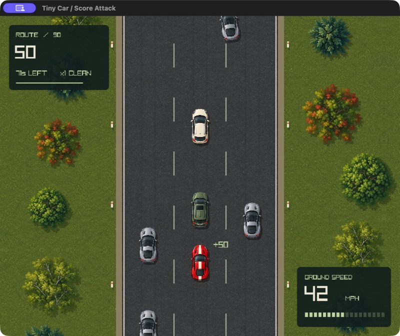
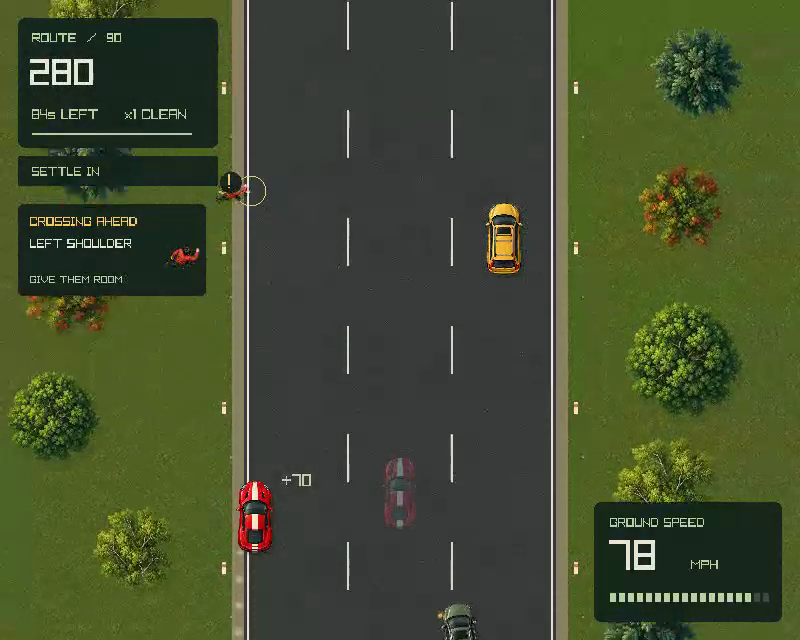
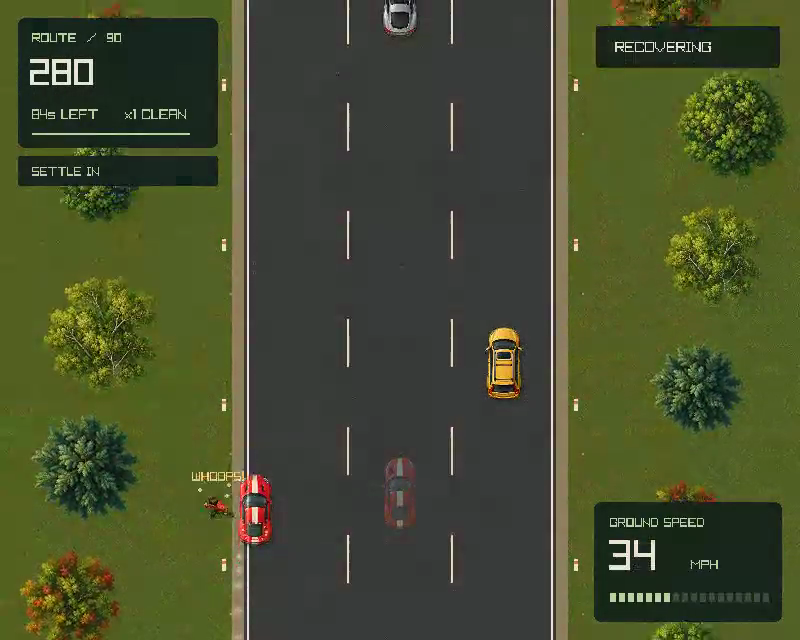
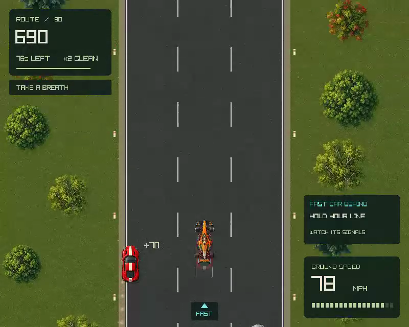

# Roadside encounters — v4

Tiny Car now mixes animated roadside crossings and fast open-wheel traffic into its 90-second score attack. Three pedestrian appearances each have four poses. Two open-wheel liveries share a longer collision body, a distinctive engine loop, and controlled passing behavior. The [art and sound record](art-v4.md) contains the generation prompts and asset details.

## Playing the encounters

Amber markers announce the side and crossing area. Pedestrians raise a hand and prepare before hopping or dashing into a shoulder; some enter an outer lane after the opening 30 seconds. They wait when traffic blocks the player's escape corridor. Contact slows the player, resets the streak, and uses the existing one-second recovery, accompanied by stars, a retreat, and a playful “WHOOPS!” sound.

Cyan arrows and an engine whine announce open-wheel cars from behind. Their clear-road speed is 200–240 mph. They brake behind blocked traffic, choose useful passing lanes, signal for one second, and merge over two seconds. They cannot award score. Hold a steady line and watch the signals.

Encounter attempts become more frequent over the three 30-second stages: every 6, 4.5, then 3.5 seconds. Each 15-second wave ends with four seconds without new spawns. Existing cars and pedestrians can still be present during those quieter stretches.

The browser repeats encounter warnings above the canvas so the text remains readable when the game shrinks to phone width. Instructions, touch controls, local records, ghosts, and API compatibility use `score-attack-v4`. Earlier records remain in their old storage keys, and old challenges need a new invitation.

## Timing and fairness

| Guard | Behavior |
| --- | --- |
| Advance warning | At least 150 simulation ticks (2.5 seconds) before a pedestrian can enter or a fast car can appear onscreen |
| Visible preparation | A pedestrian must be visible for at least 24 ticks (0.4 seconds) before entry, in addition to the advance warning |
| Usable exit | The complete lateral corridor must remain clear for 60 consecutive ticks before entry; the check includes reaction time, steering travel, closing vehicles, and both lanes of a merge |
| Traffic coordination | New spawns and lane changes respect the crossing/escape reservation; committed traffic is checked again before a dash |
| Fast-car following | Stopping-distance checks, strong braking, and a hard following limit protect a steady or emergency-braking player |
| Bounded encounters | At most one active pedestrian and one active open-wheel car |

Gameplay remains in the fixed 60 Hz simulation. Encounter randomness uses a separate seeded generator and exactly four draws per scheduled attempt, including blocked and skipped attempts. Ordinary traffic retains its 113 attempts and three draws per attempt. Rendering, animation presentation, and audio cannot consume simulation randomness. The API's pass ceiling remains valid because open-wheel cars do not award points.

## Verification

Native and WebAssembly builds, all 33 Zig regressions, all 21 browser/API tests, lint, and formatting pass. The simulation checks cover warning lead times at different speeds, emergency braking, signaled overtakes, collision alignment for different body sizes, combined encounters, deterministic scheduling, pause/restart, and identical full runs at 30, 60, and 144 Hz.

Final commands: `zig build test --summary all`, `zig build --summary all`, `bun run build:web` (ReleaseSafe), `bun run test`, `bun run lint`, `bun run format:check`, `zig fmt --check src/*.zig build.zig emcc.zig`, and `git diff --check`. All exited successfully. The Emscripten build still emits 11 warnings from bundled miniaudio/stb code; it produces the working browser bundle.

The [seed audit](qa/v4/encounter-audit.json) covers seeds 1–64 on both shoulders: 128 complete runs produced 353 pedestrian entries, including 41 outer-lane entries and 66 entries with an active fast car. Sustained shoulder driving produced 310 contacts; 113 runs had at least two. A second set of 128 runs using a scripted exit-taking driver had zero pedestrian contacts. Fast cars made 669 overtakes of ordinary cars and reached 1,200 pixels per second onscreen. Vehicle pairs remained separated in the audited runs.

Real-time checks used seed `20260905`:

| Runtime / input | Result | Evidence |
| --- | --- | --- |
| Native desktop, full cruise run | 450 points, 9 passes, 5 crashes | [Completion](qa/v4/native-complete.png) |
| WebAssembly, full cruise run at phone width | 450 points, 9 passes, 5 crashes; all 37 metrics exactly match native simulation | [Metrics](qa/v4/web-cruise.json), [completion](qa/v4/phone-complete.png) |
| WebAssembly, full gas + left-shoulder run through keyboard handlers | 6,830 points, 51 passes, 13 near misses, 4 crashes; all 37 metrics exactly match native simulation | [Timeline and metrics](qa/v4/web-left-shoulder.json), [completion](qa/v4/web-complete.png) |

[Native reference metrics](qa/v4/native-reference.json) come from `zig run src/qa_reference.zig`. Native runtime checks also exercised steering, pedals, mute, restart, and keyboard pause/resume. The new atlases and all sounds loaded successfully through Raylib/CoreAudio.

The browser used real pointer presses and verified capture/release on gas and steering controls. At 390 × 844, controls were at least 48 pixels tall and warning text remained 12 pixels with no horizontal overflow. Automated regressions separately cover multiple held pointers and cancellation. Opening instructions during combined warnings froze all 37 metrics; closing the dialog left the run paused. Captured audio RMS was zero during pause and after completion, and nonzero during play. The browser reported no console errors or warnings. See [pointer evidence](qa/v4/pointer-capture.json), [pause evidence](qa/v4/pause-runtime.json), and [phone warnings](qa/v4/phone-warning.png).

## Captures

Before, native v3:

After, native v4 with a roadside pedestrian and both warning types:

[Browser before](qa/v4/before-web.png) · [Browser after](qa/v4/after-web.png)

Pedestrian dash and contact:

Open-wheel pass:

[24-second encounter video with game audio](qa/v4/encounters-first-wave.mp4)

## Remaining playtest limits

The seed audits use scripted driving policies and cannot establish that every possible driving choice feels fair. Broad human playtesting is still needed for warning comprehension, difficulty, shoulder balance, and the sound mix. Phone checks used a desktop browser at phone dimensions and real pointer capture; physical phone multitouch, Safari/mobile audio, and performance on lower-powered devices have not been verified. Native playback was checked on macOS, not Windows or Linux.
