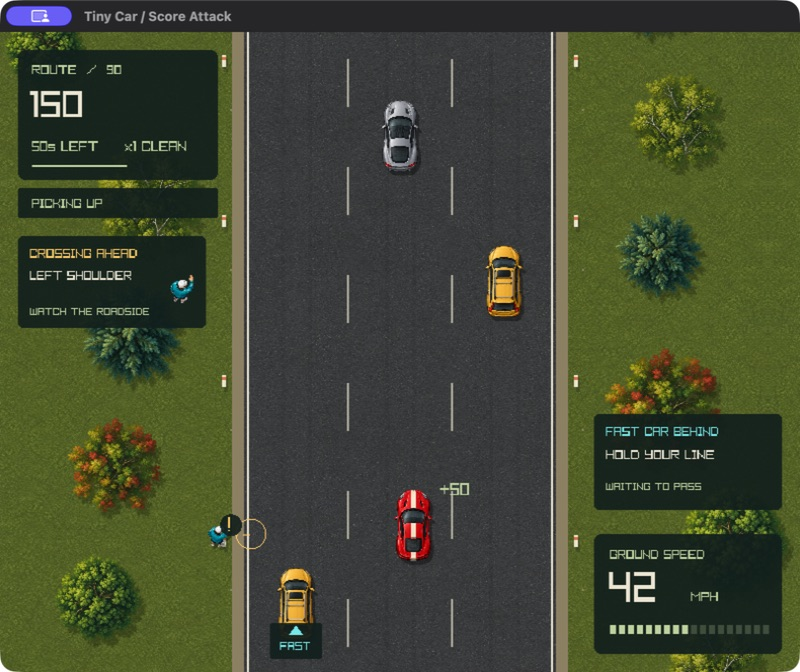
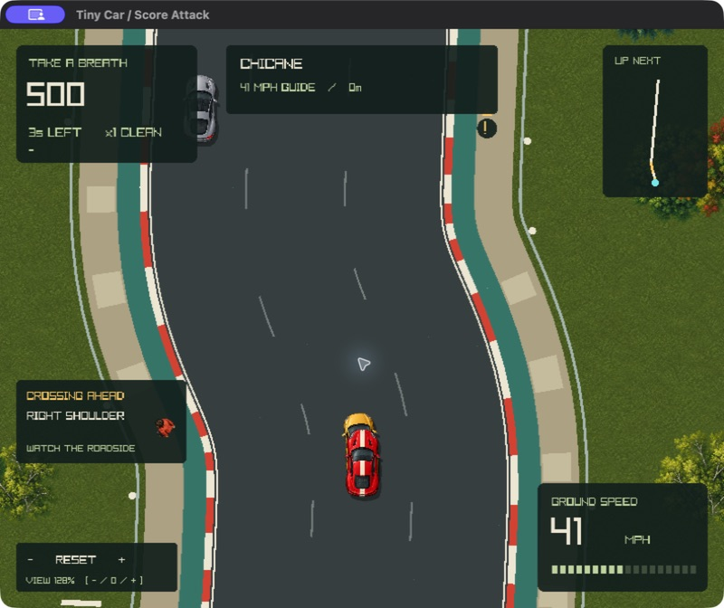
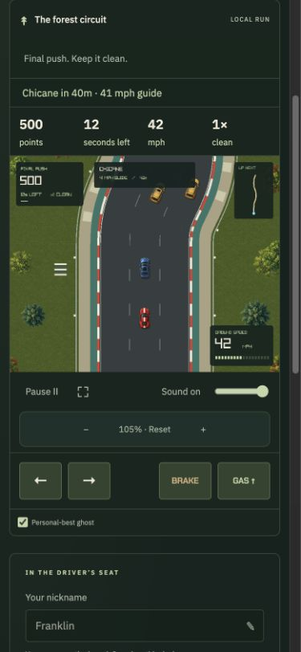

# Forest circuit · v5

Tiny Car now follows a seeded racing route. Red and cream curbs, marked lanes, green paved margins, gravel runoff, barriers, trees, and small spectator stands carry the forest theme through bends.

The opening straight gives drivers time to settle. The first set of corners uses 65% of the later steering demand. Each 8,800-pixel section combines sweeping bends, short straights, tighter corners, and a chicane. The seed chooses direction and varies the turn strength. Straights of 1,000–1,200 pixels give room between demanding sections. Existing 15-second encounter waves still include a four-second lull.

## Driving

Speed creates outward drift in corners. The inside lane has a tighter radius and needs more grip; a wider entry gives more room to turn. Brake before the apex, then accelerate as the route straightens. Runoff slows the car more strongly in tight corners. The 42 mph cruise, speed-sensitive steering, 90 mph maximum, countdown, 90-second timer, and pass scoring remain.

The top route strip shows the next 1,400 pixels independently of zoom. A shared corner label and speed guide appear in the HUD and in readable text above the browser canvas. The guide is advisory: nearby traffic and your chosen line still determine a safe move.

## Shared geometry and fair encounters

`route.zig` builds a continuous centerline at 20-pixel intervals from an arc-length heading profile. Cubic sine turns meet straights with zero curvature. `road.bend` places each body on the route normal and adds the tangent angle to its steering angle. Cars, open-wheel cars, pedestrians, their marks, and collisions use that transform. Shoulder slowdown projects all four visible body corners back onto the curved edges.

Traffic reserves its current and target lanes. Extra longitudinal space anticipates compression on the inside of a curve. Fast cars brake before tight sections and defer new lane changes until the road is gentle enough. Their 150-tick warning, one-second signal, two-second merge, and following floors remain.

Pedestrian placement searches ahead for a mild crossing section and rechecks the approach at entry. Preparation uses a conservative visible region below the HUD, including at maximum zoom. The 150-tick warning, 24 visible preparation ticks, 60 consecutive clear escape ticks, and lane reservations remain. Unsafe attempts are skipped. The route does not force an entry to satisfy a spawn count.

All random draws retain their fixed schedules. There are 113 ordinary spawn attempts, with exactly three draws each, and four draws per encounter attempt. Route generation has its own deterministic seed calculation and consumes neither stream.

## Camera and compatibility

Use **− / +** to zoom and **0** to reset. The native game also accepts the mouse wheel and its on-screen view buttons. The browser has 44-pixel camera buttons and wheel zoom over the canvas. Phone layouts also show score, time, speed, and multiplier in a separate 17-pixel status row. Shortcuts ignore text fields, editable content, dialogs, and browser modifier keys. Camera controls do not clear held driving input. Browser pinch shortcuts retain their normal behavior.

The scale eases between 0.65 and 1.05; the default is 0.82. The UI displays this as 79–128% of the default view. Translation follows route progress, rotation eases through changes of direction, and HUD text retains its size. Camera state is separate from the race. Pausing freezes the race while still allowing view adjustment.

The bridge and API use `score-attack-v5`. Old challenges, pending submissions, bests, and ghosts are excluded from these rules. Nickname and audio preferences remain. Ghost samples now store lane position, local y, steering angle, and route distance, so a ghost appears at its own place on the circuit. Invalid and old three-value samples are hidden.

## Verification

The [simulation audit](qa/v5/encounter-audit.json) covers 128 shoulder runs, 128 drivers responding to crossing warnings, and 32 runs with changing steering and braking. The shoulder and varied-input cases check all active vehicle pairs in world space every tick. The shoulder cases produced 88 pedestrian entries, including 37 with an active fast car; warning-responsive drivers had zero pedestrian contacts. Fast cars made 791 passes of ordinary traffic. Crossings are intentionally less frequent than on v4's straight highway.

The simulation suite also checks curved lane width and footprint alignment over 44,000 pixels, braking and driving-line effects, pause/restart behavior, warning gates, zoom limits and easing, and complete 30/60/144 Hz replays while changing zoom. Browser/API regressions cover four-value ghost interpolation, old-rule isolation, concurrent touch inputs, zoom controls, dialog handling, and score validation.

All [required checks](qa/v5/checks.json) passed: native build, WebAssembly ReleaseSafe build, 39 simulation tests, 24 browser/API tests, lint, Oxfmt, Zig formatting, and whitespace validation. The local score API also reports v5.

| Runtime check | Result | Evidence |
| --- | --- | --- |
| Native macOS, complete cruise run with zoom and pause/resume | 500 points · 9 passes · 6 crashes | [Completion](qa/v5/native-complete.png) |
| WebAssembly, complete gas + left run while cycling zoom | 4,000 points · 29 passes · 2 crashes; all 43 metrics exactly match native | [Replay and timing](qa/v5/web-zoom-replay.json), [parity](qa/v5/replay-parity.json) |
| WebAssembly at 390 × 844, complete cruise run with instructions/pause/resume | All 43 metrics exactly match native cruise | [Metrics](qa/v5/phone-cruise.json), [completion](qa/v5/phone-complete.png) |
| Phone controls | No overflow; 44-pixel zoom and 48-pixel driving buttons; real pointer capture and release | [Pointer events](qa/v5/phone-pointer-capture.json), [layout](qa/v5/phone-after.png) |
| Instructions and combined warnings | All simulation metrics and requested zoom frozen; close leaves run paused | [Pause check](qa/v5/phone-pause.json) |
| Live camera transitions | 180 frames, monotone easing at both limits and reset; all 43 race metrics unchanged | [Samples](qa/v5/camera-transitions.json) |

## Captures

Before: the archived v4 straight-road native capture.

After: the v5 circuit, with shared curved vehicle geometry, curbs, runoff, route preview, and the camera at its closest view.

[Zoomed out / 79%](qa/v5/native-zoom-out.png) · [Zoomed in / 128%](qa/v5/native-zoom-in.png) · [Native pause and reset](qa/v5/native-paused.png) · [Browser before](qa/v5/before-web.png) · [Browser after](qa/v5/after-web.png)

## Remaining playtest limits

Runtime playtests used macOS arm64 and Chromium with a phone-sized viewport. Physical phone touch hardware, Safari/WebKit, and native Windows/Linux builds were not exercised. Pointer capture was tested through real browser presses; simultaneous touches and cancellation also have regression coverage. Full runs used repeatable held inputs and cruise, with additional native key and mouse checks, rather than a broad human playtesting group. Competitive balance and long-session comfort still benefit from human feedback. Nothing was deployed to production.

